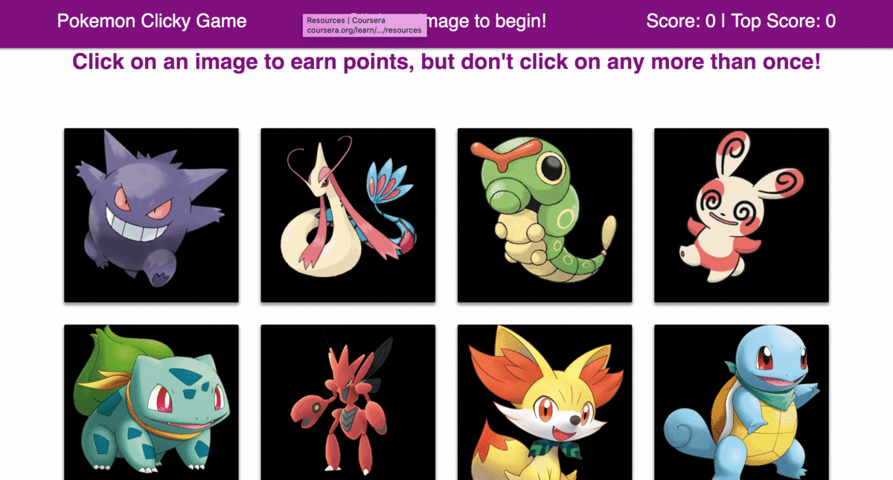

# Pokemon Clicky Game

## Overview

This is a React app developed as part of an assigment during my Bootcamp classes. It is a memory card game, the deck is shuffled every time you click on a Pokemon, the rule is that you can not repeat a card, the game keeps your top score and the current score.

Try the app here: 

## Getting Started

## Built With

- Html
- Bootstrap
- Javascript
- Jquery
- React

## Screenshots

## Comments

This was my first React project, it was challenging.
The assignment required: Create a memory game with React. It will require to break up the application's UI into components, manage component state, and respond to user events.

## Author

Isabel Arcones: https://github.com/iarcones

Here I will be updating some samples of my projects: https://iarcones.github.io

## Acknowledgments
Jerome Chenette,
Jimmy Tu,
Sasha Patsel

